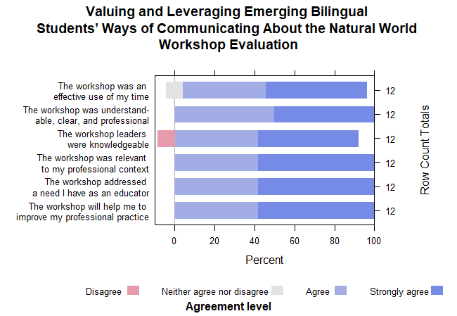

```{r setup, include=FALSE}
knitr::opts_chunk$set(echo = FALSE)
```


```{r library, include=FALSE}
library(tidyverse)
library(DT)
library(apaTables)
library(janitor)
library(knitr)
library(ggplot2)
library(wesanderson)
library(patchwork)
library(Hmisc)
library(xtable)
```


```{r data}
data <- read.csv(here::here("data","Mid-TN-STEM-Hub-bilingual.csv"))
```

### Survey participants: Teachers
```{r total}
participants <- data %>% 
    filter(Finished == "TRUE") %>%
    count() %>%
    dplyr::rename("Total" = n) 
rownames(participants) <- c("Unique Responses")
participants %>% kable()
    
```

### Teachers' roles?
Note: Some teachers have multiple roles
```{r roles}
data %>% 
    select(Q15_1:Q15_8) %>%
    pivot_longer(Q15_1:Q15_8, values_to = "ROLE") %>%
    select(ROLE) %>%
    drop_na() %>%
    filter(ROLE != "") %>%
    tabyl(ROLE) %>%
    arrange(desc(n)) %>%
    adorn_pct_formatting(digits = 2) %>%
    adorn_totals(c("row")) %>%
    kable()
```

```{r otherroles}
data %>%
    select(Q15_8_TEXT) %>%
    drop_na() %>% 
    filter(Q15_8_TEXT != '') %>%
    distinct(Q15_8_TEXT) %>%
    dplyr::rename("Other Teacher Roles" = Q15_8_TEXT) %>%
    kable()
```

### Grades taught in
Note: Some teachers teach multiple grades
```{r grades}
 data %>% 
    select(Q16_1:Q16_17) %>%
    mutate_all(as.character) %>%
    pivot_longer(Q16_1:Q16_17, values_to = "GRADE") %>%
    select(GRADE) %>% 
    drop_na() %>%
    filter(GRADE != '') %>%
    group_by(GRADE) %>%
    count() %>%
    ggplot(aes(x = factor(GRADE, levels = c("PreK/K", as.character(1:12))), 
               y=n)) +
    geom_bar(aes(fill=GRADE), stat = 'identity') +
    geom_text(aes(label=paste0(n), y=n + 0.1 )) +
    coord_flip() +
    scale_fill_manual(values=wes_palette(n=13, name="Darjeeling2", type ="continuous")) +
    labs(
    title = "Grades taught",
    subtitle = "Note: Many teachers teach multiple grades"
    )+
    theme_classic()+
    theme(
    plot.title = element_text(hjust = 0.5),
    legend.position = "none",
    axis.title.x = element_blank(),
    axis.title.y =element_blank()
  ) -> teach_grades
teach_grades
```

### Overall how satisfied teachers were with the workshop?
```{r satisfactory}
data %>% 
    dplyr::select(SATISFIED) %>%
    mutate(SATISFIED = factor(SATISFIED, c("Very satisfied", "Satisfied","Somewhat satisfied"))) %>%
    tabyl(SATISFIED) %>%
    adorn_pct_formatting(digits = 2) %>%
    adorn_totals(c("row")) %>%
    rename("Overall satisfactory" = SATISFIED) %>%
    kable()
data %>% 
    select(SATISFIED) %>%
    group_by(SATISFIED) %>%
    count() %>% 
    ungroup() %>%
    mutate(pct = prop.table(n)) %>%
    ggplot(aes(x= factor(SATISFIED, levels = c("Very satisfied", "Satisfied","Somewhat satisfied", "Not satisfied")), 
               y=pct)) +
    geom_bar(aes(fill=SATISFIED), stat = 'identity') + 
    geom_text(aes(label=paste0(round(pct*100, digits = 2),"%")), vjust=-0.5) +
    scale_y_continuous(labels = scales::percent_format(), limits=c(0,1))+
    scale_fill_manual(values=wes_palette(n=4, name="Darjeeling2", type ="continuous")) +
    labs(
    title = "Overall satisfactory"
    )+
    theme_classic()+
    theme(
    plot.title = element_text(hjust = 0.5),
    legend.position = "none",
    axis.title.x = element_blank(),
    axis.title.y =element_blank()
  ) -> overall_satisfactory_viz
```

### How satisfied teachers were with the information received from the workshop?
```{r infor}
data %>% 
    select(INFOR) %>%
    mutate(INFOR = factor(INFOR, c("All the information", "Most of the information","Some of the information", "None of the information"))) %>%
    tabyl(INFOR) %>%
    adorn_pct_formatting(digits = 2) %>%
    adorn_totals(c("row")) %>%
    rename("Information satisfactory" = INFOR) %>%
    kable()

data %>%
  select(INFOR) %>%
  group_by(INFOR) %>%
  count() %>% 
  ungroup() %>%
  mutate(pct = prop.table(n)) %>%
  ggplot(aes(x= factor(INFOR, levels = c("All the information", "Most of the information","Some of the information", "None of the information")), 
               y=pct)) +
  geom_bar(aes(fill=INFOR), stat = 'identity') + 
  geom_text(aes(label=paste0(round(pct*100, digits = 2),"%")), vjust=-0.5) +
  scale_y_continuous(labels = scales::percent_format(), limits=c(0,1))+
  scale_x_discrete(labels = str_wrap(c("All the information", "Most of the information","Some of the information", "None of the information"), width = 10)) +
  scale_fill_manual(values=wes_palette(n=4, name="Darjeeling2", type ="continuous")) +
  labs(
    title = "Information satisfactory"
    )+
    theme_classic()+
    theme(
    plot.title = element_text(hjust = 0.5),
    legend.position = "none",
    axis.title.x = element_blank(),
    axis.title.y =element_blank()
  ) -> infor_viz
  

```

### How well did the technology work ? 
```{r tech}
data %>% 
    dplyr::select(TECH) %>%
    mutate(TECH = factor(TECH, c("Extremely well", "Fairly well", "Fairly poorly"))) %>%
    tabyl(TECH) %>%
    adorn_pct_formatting(digits = 2) %>%
    adorn_totals(c("row")) %>%
    rename("Technology satisfactory" = TECH) %>%
    kable()

data %>%
  select(TECH) %>%
  group_by(TECH) %>%
  count() %>%
  ungroup() %>%
  mutate(pct=prop.table(n)) %>%
  ggplot(aes(x= factor(TECH, levels = c("Extremely well", "Fairly well", "Fairly poorly")), 
               y=pct)) +
  geom_bar(aes(fill=TECH), stat = 'identity') + 
  geom_text(aes(label=paste0(round(pct*100, digits = 2),"%")), vjust=-0.5) +
  scale_y_continuous(labels = scales::percent_format(), limits=c(0,1))+
  scale_x_discrete(labels = str_wrap(c("Extremely well", "Fairly well", "Fairly poorly"), width = 15)) +
  scale_fill_manual(values=wes_palette(n=4, name="Darjeeling2", type ="continuous")) +
  labs(
    title = "Technology satisfactory"
    )+
  theme_classic()+
  theme(
    plot.title = element_text(hjust = 0.5),
    legend.position = "none",
    axis.title.x = element_blank(),
    axis.title.y =element_blank()
  ) -> Tech_viz
```


```{r}
overall_satisfactory_viz / (infor_viz + Tech_viz)
```

### Workshop evaluation

```{r, echo=FALSE}
workshop_eval <- data %>%
    dplyr::select(AGREE_1:AGREE_6) %>%
    gather(measure, response) 

```
```{r}
### Creating the contingency table
contingencytable <- table(workshop_eval$measure, workshop_eval$response) %>% as.data.frame.matrix() 
```
```{r}
# Reorder columns
contingencytable <- contingencytable %>% 
    data.table::setcolorder(c("Disagree",
                              "Neither agree nor disagree",
                              "Agree",
                              "Strongly agree"))
```
```{r}
# Changing row name
rownames(contingencytable) <- c("The workshop was an effective use of my time",
                                "The workshop was understandable, clear, and professional" ,
                                "The workshop leaders were knowledgeable",
                                "The workshop was relevant to my professional context",
                                "The workshop addressed a need I have as an educator",
                                "The workshop will help me to improve my professional practice")
```
```{r}
# adding rownames to columns
contingencytable <- tibble::rownames_to_column(contingencytable, var = "Measure")
```
```{r}
# knitting to table
contingencytable %>% kable()
```

